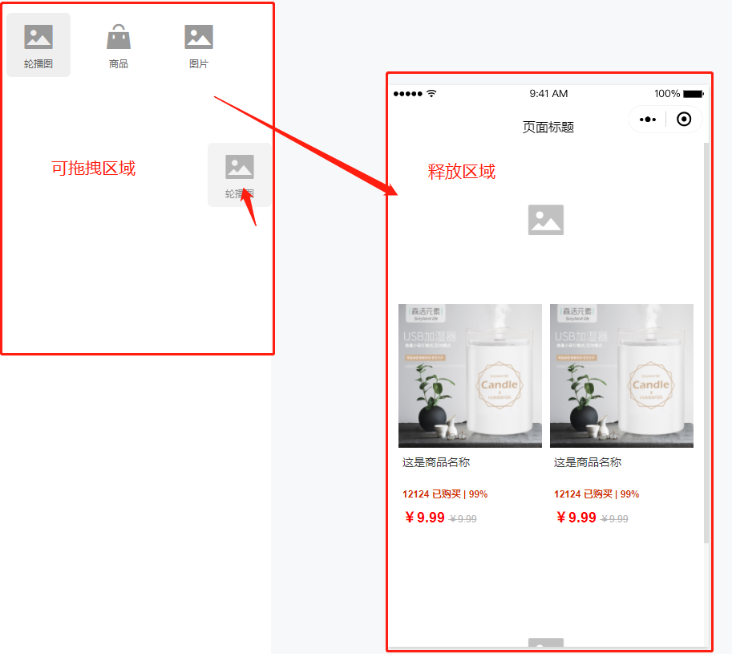
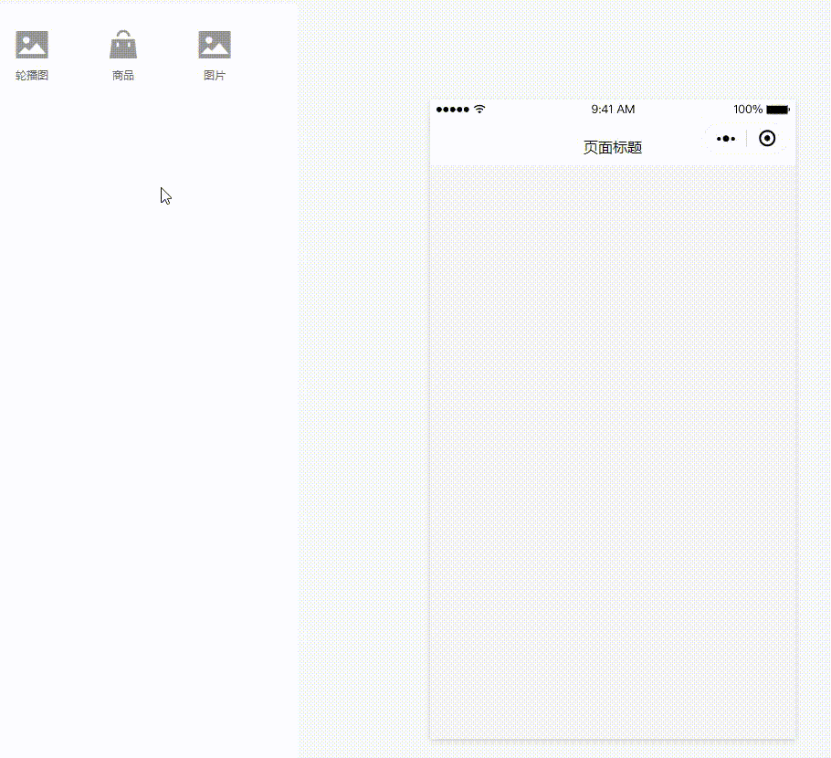

# 可视化页面编辑器

[在线地址](https://demo-page.raindays.cn)

可视化页面编辑器，听起来可望不可即是吧，先来张动图观摩观摩一番！


实现这功能之前，在网上参考了很多资料，最终一无所获，五花八门的文章，都在述说着曾经的自己！

那么，这时候就需要自己去琢磨了，如何实现？

需要考虑到：

- 拖拽的实现
- 数据结构的定义
- 组件的划分
- 可维护性、扩展性


> **对象的引用**：在这里是我感觉最酷的技巧了，来一一讲解其中的细节吧！！


## 拖拽实现

### 拖拽事件

这里使用 [H5的拖拽事件](https://developer.mozilla.org/zh-CN/docs/Web/API/HTML_Drag_and_Drop_API) ，主要用到：

```js
dragstart   // 开始拖拽一个元素时触发
draggable   // 指定可被拖拽的元素
dragend     // 当拖拽操作结束时触发
dragover    // 当拖拽元素在可释放目标上移动时触发
drop        // 当拖拽元素在可释放目标上被释放时触发
```

我们来看看怎么使用这些事件：

```html
<!-- 拖拽元素列表数据 -->
<script>
// com 为对应的视图组件，在释放区域显示
typeList: {
    banner: {
        name: '轮播图',
        icon: 'el-icon-picture',
        com: Banner
    },
    product: {
        name: '商品',
        icon: 'el-icon-s-goods',
        com: Product
    },
    images: {
        name: '图片',
        icon: 'el-icon-picture',
        com: Images
    },
}
</script>
<!-- 拖拽元素 -->
<ul 
    @dragstart="dragStart"
    @dragend="dragEnd"
>
    <li 
        v-for="(val, key, index) in typeList"
        draggable 
        :data-type="key"
        :key="index + 1"
    >
        <span :class="val.icon"></span>
        <p>{{val.name}}</p>
    </li>
</ul>
<!-- 释放区域 -->
<div 
    class="view-content"
    @drop="drog"
    @dragover="dragOver"
>
</div>
```




### 拖拽开始

定义一个变量`type`，用于触发拖拽事件开始的时候，确定当前拖拽元素是哪种类型，比如：产品、广告图...

```js
// 拖拽类型
dragStart(e) {
    this.type = e.target.dataset.type
}
```

确定类型后，再进入下一步的释放区域
### 在释放区域中移动

移动的过程中，需要根据鼠标位置实时更新拖拽元素的位置，具体可往下翻预览动图效果！

```js
// 'view-content': 外层盒子的class，直接 push
// 'item': 盒子内部的元素，需计算位置，进行变换操作
dragOver() {
    let className = e.target.className
    let name = className !== 'view-content' ? 'item' : 'view-content'

    // 组件的默认数据
    const defaultData = {
        type: this.type,    // 组件类型
        status: 2,          // 默认状态
        data: [],           // 基本数据
        options: {}         // 其他操作
    }

    if (name == 'view-content') {
        //...
    } else if (name == 'item') {
        //...
    }
}
```

### 边界处理、角度计算

核心变量：

- `isPush`：拖拽元素是否已push到页面数据中
- `index`：拖拽元素最终的索引值
- `curIndex`：鼠标所在位置的元素的索引值
- `direction`：鼠标所在元素的上/下部分

当 `name=='view-content'`，说明拖拽元素处于外层且空白的可释放区域，如果未添加状态，直接`push`即可

```js
if (name == 'view-content') {
    if (!this.isPush) {
        this.index = this.view.length
        this.isPush = true
        this.view.push(defaultData)
    }
}
```

当 `name=='item'`，也就是在已有元素的上方，则需要计算位置，上/下方，添加 or 移动

```js
if (name == 'item') {
    let target = e.target
    let [ y, h, curIndex ] = [ e.offsetY, target.offsetHeight, target.dataset.index ]
    let direction = y < (h / 2) // 计算鼠标处于当前元素的位置，来决定拖拽元素的上/下

    if (!this.isPush) {
        // first
        if (direction) {
            if (curIndex == 0) {
                this.view.unshift(defaultData)
            } else {
                this.view.splice(curIndex, 0, defaultData)
            }
        } else {
            curIndex = +curIndex + 1
            this.view.splice(curIndex, 0, defaultData)
        }
    } else {
        // Moving
        if (direction) {
            var i = curIndex == 0 ? 0 : curIndex - 1
            var result = this.view[i]['status'] == 2
        } else {
            var i = +curIndex + 1
            var result = this.view.length > i && this.view[i]['status'] == 2
        }
        
        // 拖拽元素是否需变换位置
        if (result) return

        const temp = this.view.splice(this.index, 1)
        this.view.splice(curIndex, 0, temp[0])
    }
    this.index = curIndex   // 拖拽元素位置
    this.isPush = true      // 进入则push，即true
}
```

- `first`：未 `push`，则根据当前 `index` 和 `direction` 来决定拖拽元素的位置
- `Moving`：已 `push` 且移动状态，根据当前 `index` 和 `direction` 来找出对应值的状态，是否为拖拽元素，是则 `return`，否则变换位置

总结一下：**获取当前鼠标所在的元素索引，再计算鼠标是在元素的`上半部分`还是`下半部分`，以此推断出拖拽元素的位置！！！**




小问题：

上面的 `name=='item'`，`Event` 事件需要阻止默认事件，避免 `target` 为内层元素，导致无法计算位置，但是只用事件阻止在这里行不通，也不知道为啥，需要把 `.item` 的所有子元素加上 `pointer-events: none` 的属性才行！

```js
e.preventDefault()
e.stopPropagation()

.item div{
    pointer-events: none;
}
```

### 拖拽结束

即松开鼠标、或离开释放区域，则恢复默认状态。

这里的`status`有什么作用呢

1. 上方的计算规则，用于判断元素是否为拖拽元素。
2. 页面的显示方式，拖拽的时候只显示组件名，释放之后才恢复正常显示内容。

```js
// 结束拖拽
dragEnd(e) {
    this.$delete(this.view[this.index], 'status')
    this.isPush = false
    this.type = null
},
// 已放置到指定位置
drog(e) {
    e.preventDefault()
    e.stopPropagation()
    this.dragEnd()
},
```

## 组件划分

中间视图组件，右边编辑组件，为一套一套的，果然是一套一套的，不愧是有一套一套的！

`page=>index` 则管理着整个页面的内容

```bash
.
├── components
|   ├── Edit           ## 右边编辑
|   |    ├── Info       # 基本信息
|   |    ├── Image      # 广告图
|   |    ├── Product    # 商品
|   |    └── Index      # 管理编辑组件的信息
|   └── View           ## 中间视图
|   |    ├── Banner     # 轮播图
|   |    ├── Images     # 广告图
|   |    └── Product    # 产品列表
└── page
    └── index          ## 主页面
```

想要实现预览页面的效果，直接使用 `components=>View` 下面的组件即可，与 `page=>index` 使用方法一致，无需过多修改！

## 数据结构的定义

实现一个鲜艳且具有扩展性的功能，那么定义一个符合条件的数据结构是必不可少的！与此同时也能决定你的代码质量！

当然，还是得由自身的逻辑思维来决定！

这里最亮眼的处理方法为：**借用对象的关系，使得组件之间的传值，只需单向一次！**

对象是指向同一个内存堆的，存在着一种引用关系，只需修改一次即可实现多方位的数据更新！

```js
view: [
    {
        type: 'info',
        title: '页面标题',
        remarks: '页面备注',
        backgroundColor: 'red'
    },
    {
        type: 'banner',
        data: [
            { url: '1.jpg', name: '轮播图1', link: 'https://轮播图跳转地址.cn' },
            { url: '2.jpg', name: '轮播图2', link: 'https://轮播图跳转地址.cn' }
        ]
    },
    {
        type: 'images',
        data: [
            { url: '1.jpg', name: '广告图1', link: 'https://广告图跳转地址.cn' },
            { url: '2.jpg', name: '广告图2', link: 'https://广告图跳转地址.cn' }
        ]
    },
    {
        type: 'product',
        data: [
            { id: '1', name: '商品1', image: '1.jpg' }, 
            { id: '2', name: '商品2', image: '2.jpg' }
        ],
        options: {
            originalPrice: true,    // 划线价
            goodRatio: true,        // 好评率
            volumeStr: false,       // 销量数
        }
    }
]
```

就是一个数组，数组的`item`代表着一个模块

- `type`：模块类型
- `data`：基本信息
- `options`：其他操作

....可参考原有组件模块，按照需求去自行扩展等操作

## 图片上传

刚好上面有图片上传组件，这里分享一下我的使用技巧！！

使用 `Element-ui` 自带上传组件的朋友，看过来（敲黑板）

我们先来实现一个简约版的：

```html
<!-- 禁用所有默认方法 -->
<el-upload
    :http-request="upload"
    :show-file-list="false"
    multiple
    action
>
    
</el-upload>
<script>
upload(params) {
    const file = params.file;
    const form = new FormData();
    form.append("file", file);
    form.append("clientType", "multipart/form-data");

    const index = this.imageIndex
    const data = { 
        url: URL.createObjectURL(file), 
        form
    }
    if (index !== null) {
        this.$set(this.list, index, data)
    } else {
        this.list.push(data)
    }
}
</script>
```

- 重写上传方法
- 使用 `URL.createObjectURL(file)` 创建一个本地预览的地址
- 把 `form` 对象存起来，提交时再上传

```js
// 根据上面的代码，使用Promise实现上传功能
const request = []
this.list.forEach(item => {
    request.push(
        new Promise((resolve, reject) => {
            /**
             * 上传接口
             * 替换原 url
             * 删除 form
             */
            imageUpload(item.form).then(res => {
                item.url = res.data.url
                delete item.form
                resolve(res)
            }).catch(err => {
                reject(err)
            })
        })
    )
})
Promise.all(request).then(res => {
    // ... submit ...
})
```

等到最后一步提交数据的时候，再上传所有的图片，结束之后再去调用提交数据的接口！！

### 内容块拖拽实现

因时间关系，这里偷懒了，使用了一个较为完美的列表拖拽插件 [Vue.Draggable](https://github.com/SortableJS/Vue.Draggable) (star 14.2k)

研究了一会，其逻辑和上方实现的拖拽有一定联系，具体实现方法大同小异，相信有了上面的实战案例，你也就能做出来了！

要不，你动手试试？ 

可以根据`Vue.Draggable`的使用方式，来实现一个拖拽组件，具体会用到（drag、slot、DOM）等等

（后面有时间，我再回来封装一个）
## 最后总结

"数据结构的定型，组件交互的处理。"

核心点已经实现了，其他的——例如新增组件、新增操作等等，已经不是问题了，剩下的问题已不再是问题！

可按照需求，去优化，有兴趣可以自己去琢磨琢磨，完善起来！

[Github 地址，感谢您的 star，我是不吃茶的李白。](https://github.com/wsydxiangwang/Visualization-Page)